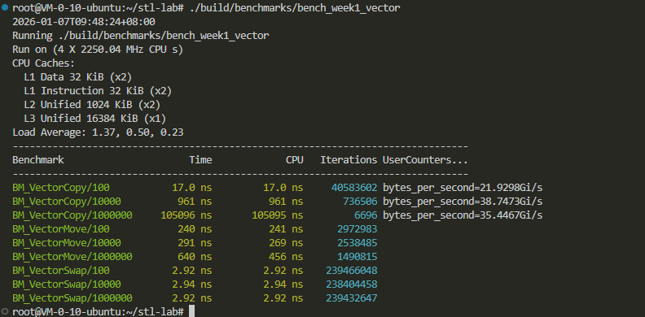
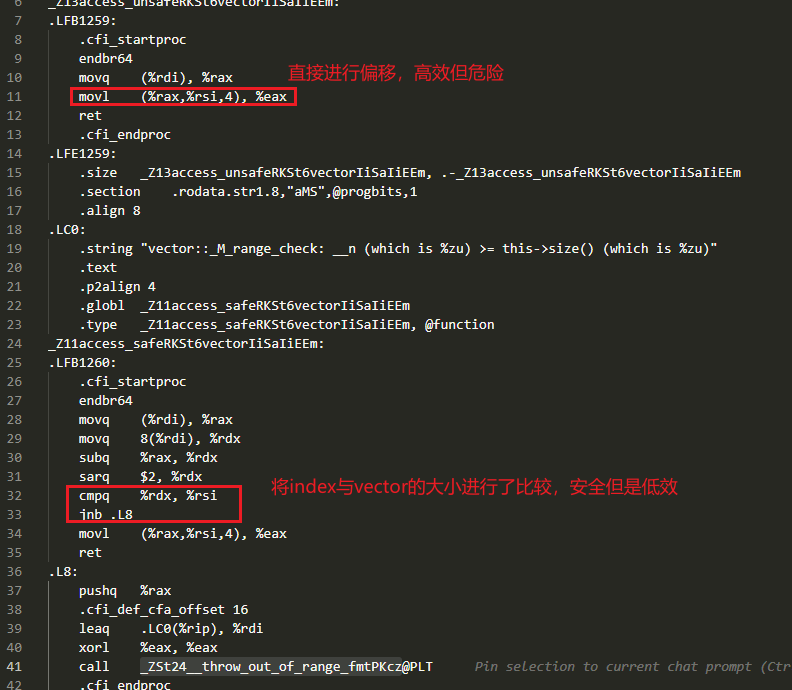

# Week 1: STL 契约与底层机制总结

## 1. 核心结论表 (Key Takeaways)

| 场景                  | 关键结论 (Quant-Dev 视角)                              | 证据/原因                                                         |
| :-------------------- | :----------------------------------------------------- | :---------------------------------------------------------------- |
| **Vector 访问** | 严禁在热路径使用 `at()`，必须用 `[]`               | **Codegen**: `at()` 包含 `cmp` 和跳转指令，破坏流水线。 |
| **Vector 扩容** | 扩容会导致**所有**迭代器、指针、引用失效         | **Lab**: 观察到 `double free` 错误，旧内存被释放。        |
| **Hash Rehash** | Rehash 导致迭代器失效，但**引用保持有效**        | **Lab**: 只有 Bucket 数组被重建，Node 节点地址未变。        |
| **Move 性能**   | Move 本身是 O(1)，但测得耗时可能包含**析构开销** | **Bench**: 大对象 Move 后销毁触发 `munmap` 系统调用。     |
| **批量删除**    | 禁止在循环中手写 `erase` (O(N^2))                    | **Alg**: 应使用 `erase-remove` 惯用法 (O(N))。            |

---

## 2. 失效规则与异常安全 (Reference Guide)

### 迭代器失效

* **Vector**: 插入导致扩容时全失效；未扩容时插入点之后失效。删除点之后失效。
* **Unordered Map**: Rehash 时迭代器失效，但**指针/引用 (T&)** 依然有效（重要！）。
* **Map/List**: 插入永不失效（除了 iterator 自身）；删除仅失效被删的那个。

### 异常安全 (Exception Safety)

* **Vector**: `push_back` 提供强异常保证（前提：元素类型的 Move Ctor 是 `noexcept`）。
* **Node-based (Map/List)**: 只要不涉及多节点更新，通常天然具备强异常保证。

---

## 3. 过时 vs 经典 vs 现代对照表

| 场景               | 过时/C 风格写法                | 经典 C++98/03                        | 现代 C++11/14/20                                  |
| :----------------- | :----------------------------- | :----------------------------------- | :------------------------------------------------ |
| **删除元素** | 手写 `for` 循环 + `erase`  | `v.erase(remove_if(...), v.end())` | **C++20**: `std::erase_if(v, pred)`       |
| **返回集合** | `void get_data(vector* out)` | `void get_data(vector& out)`       | **RVO**: `vector get_data()` (直接值返回) |
| **资源转移** | `swap` 技巧模拟移动          | `swap`                             | `std::move` / 移动构造                          |

---

## 4. 实验证据链 (Evidence)

### Bench: Vector Copy vs Move vs Swap

> (在此处贴上你 benchmarks 运行结果的截图或文字表格)
> 结论：Move/Swap 均为 O(1)，但需注意大对象的析构延迟。

### Codegen: operator[] vs at()

> (在此处贴上汇编截图或关键指令对比)
> 结论：`at()` 产生了额外的 `cmp` 和异常分支。

