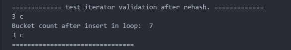

# 迭代器失效规则

+ vector:

  + 插入：在不会产生重新分配的情况下不会导致当前迭代器失效，但是之后的所有迭代器都会失效

  ```c++
    // 2. vector 插入对迭代器的影响（产生内存重新分配）
  vector<int> v2{1,2,3,4,5,6,7,8};
  cout << "size of v2: " << v2.size() << endl;
  vector<int>::iterator it_2_1 = v2.begin() + 1;
  cout << "value at index 1: " << *it_2_1 << endl;
  for(int i = 9; i < 20; ++i) {
    v2.push_back(i);
  }
  for_each(v2.cbegin(), v2.cend(), [](int val) {
    cout  << val << ",";
  });
  cout << endl;
  // 此时应该发生了内存重新分配， it_2_1 应该失效了
  v2.insert(it_2_1,1);
  ```
  运行结果：
  
  这个例子，在失效的迭代器的位置插入一个元素，会发生什么，注意到除了core之外，还有一个“doule free or corruption”的报错，以下是解释说明

  + 底层发生了什么：

    + Use-After-Free (UAF)： 当你调用 v2.insert(it_2_1, 1) 时，vector 内部会尝试计算插入位置（或者移动元素）。它操作了 it_2_1 指向的内存区域。
    + 踩坏了元数据 (Metadata Corruption)： 因为那块旧内存已经被 free 了，它现在归内存分配器（malloc/free）管理。分配器通常会在空闲内存块的头部或内部写一些“记账信息”（比如链表指针 fd, bk，用来连接下一个空闲块）。 你的 insert 操作（或者随后的数据移动）可能无意中覆盖/修改了这些记账信息。
    + 延迟爆炸： 程序当时可能没挂。但是，当程序结束（析构 v2）或者下一次申请内存时，分配器去检查它的链表，突然发现：“咦？这个空闲块的指针怎么指向了乱七八糟的地方？”或者是“这个块的 header 校验失败了！”。 于是，分配器检测到了堆被破坏，为了防止更严重的安全漏洞，它主动调用 abort() 终止程序，并抛出 double free or corruption。
  + 删除：

    + 删除不会导致内存重新分配，但是会导致删除点之后的所有值向前移动，是一个O(N)的操作。
    + 删除点之后的迭代器，引用，指针都会失效
    + 如果要批量删除，不要直接在 for 中 erase，这是一个 O(N^2) 的操作，使用如下的方法

    ```C++
    auto new_end = std::remove_if(v.begin(), v.end(), [](const auto& item) {return false;})
    v.erase(new_end, v.end());

    // cpp 20
    std::erase_if(v, [](const auto& item){return false;})
    ```
+ unordered_map:

  + 插入：rehash的情况下迭代器会失效，但是通过原迭代器获取的指针还是有效的（因为bucket只是一个指针数组，这个指针指向的Node并未发生变化）
    代码：
    
    代码运行结果如下：
    
    查看上图的代码，由于是采用for-range的格式写出的代码，因此 it 其实是对Node的引用，在发生rehash之后，迭代器失效了（这就是为什么只循环了一次），但是指针还是有效的。
    
  + 删除：删除节点不会导致迭代器失效，但是需要注意 erase 接口的返回值也是返回下一个迭代器
+ map：

  + 插入：直接插入的话不会导致迭代器失效，但是如果在迭代器的循环中插入的话，会导致迭代器无限往后追加，因为一直在插入
  + 删除：删除不会导致迭代器失效，但是使用erase失效会导致迭代器往后进一步
